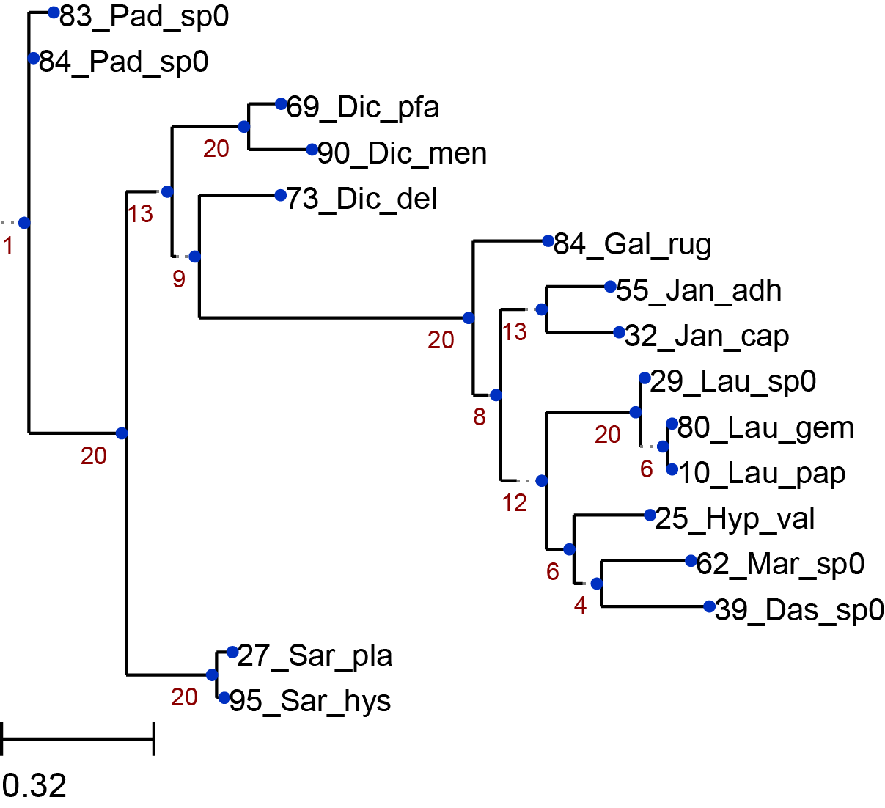

# Project_concatenating_trees

This repository contains scripts to make phylogenetic trees based on maximum likelihood using .fasta files.
It can process both single markers and can concatinate multiple markers to produce a tree based on a longer sequence.
It also allows you to specify bootstrap values.
The file has been specified for algae and seagrasses, but the names can be altered.

Required programs that need to be installed before running the script:
  - PhyML
  - ClustalW
  - ETE toolkit
  - Biopython

Content of the repository:
  - treepipeline.sh               # this is the overview-script. It refers to other scripts in this folder
  - aligner.sh                    # this is the script that aligns the sequences with nexus output
  - concatenatornexus2.py         # this python script will concatenate the sequences
  - ETE_treebuilder_from_nw.py
    (this python script will draw the trees)
  - treemaker.sh                  # this uses phyML to build trees based on single markers
  - treemaker2.sh                 # this uses phyML to build tree based on multiple markers
  - test_data                     # can be used to test the script
  - Example_results_bootstrap_20             # examples of the output of the script, when bootstrap = 20 has been used

Example of a phylogenetic tree that can be made with the script in this repository:

